# Typesense Search Engine

A self-hosted [Typesense](https://typesense.org/) instance on **Google Kubernetes Engine (GKE)** provides Red Flags Dating matching feature via search.

> Note that Typesense instance was hosted on Google Cloud Run at the beginning due to Google Cloud Storage known issues[^1] and serverless cold start bad UX, it has been migrated to GKE now.

[^1]: Google Cloud Storage `fuseops` issues, [issue 1](https://github.com/GoogleCloudPlatform/gcsfuse/issues/407) and [issue 2](https://github.com/GoogleCloudPlatform/gcsfuse/issues/296).

## Set up Typesense on GKE

### Deploy Typsense docker image

Using GKE **DEPLOY CONTAINER** to quickly deploy docker image and create required Kubernetes **Cluster**, **Deployment** and **Service**.

Google **[Kubernetes Engine](https://console.cloud.google.com/kubernetes/list/overview)** -> ***DEPLOY CONTAINER***

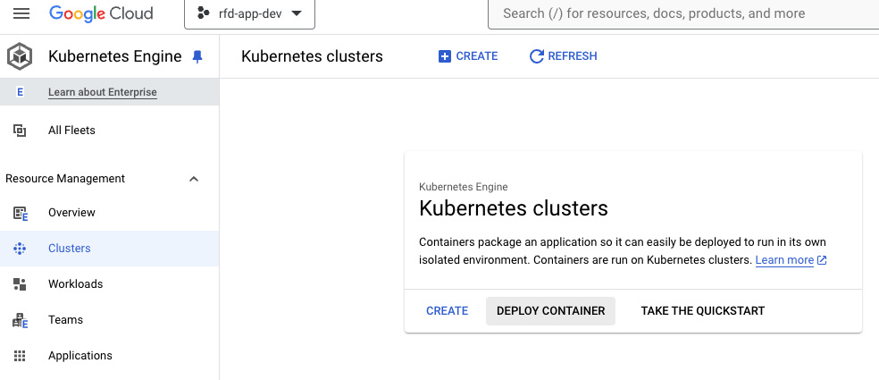

Set docker image path to `typesense/typesense:27.0.rc11` or latest tag

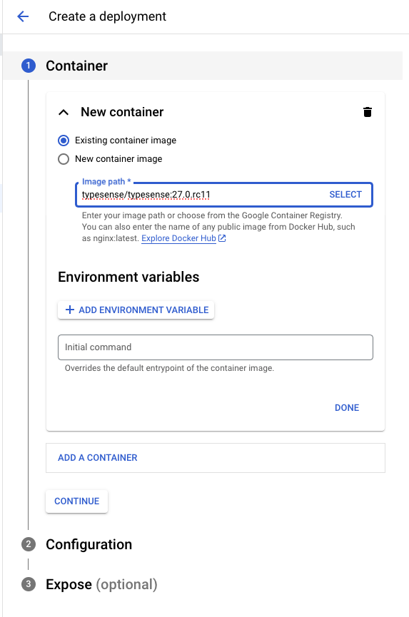

Input K8 deployment name, namespace *(ensure creating namespace for grouping K8 instances)* and zone.

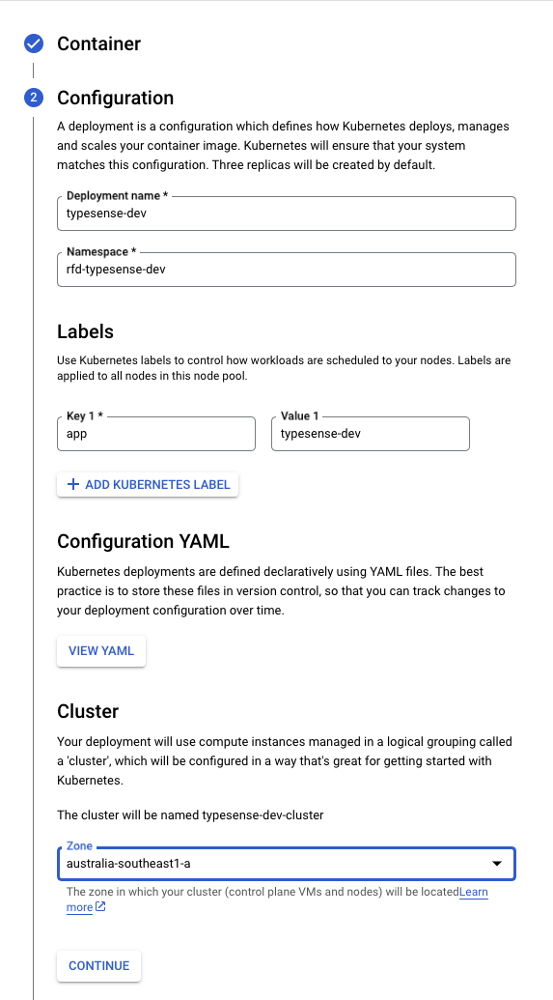

Create a K8 Service with type `Node Port` to receive external requests.

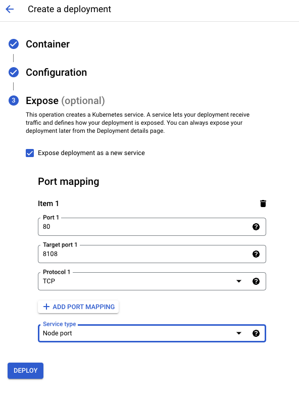

### Create persistent volume

Open `kubectl` command line panel via GKE UI.

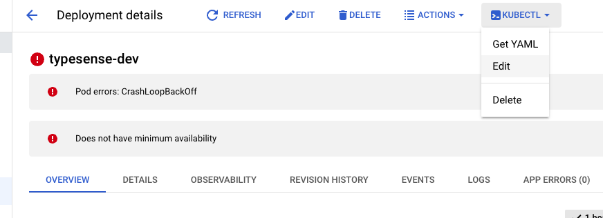

In `kubectl` console, `vi` to create a new `volume.yaml` file and copy the below snippet then paste it.

```yaml
apiVersion: v1
kind: PersistentVolume
metadata:
  name: typesense-data-pv
  namespace: rfd-typesense-dev
  labels:
    type: local
spec:
  storageClassName: "gp3"
  capacity:
    storage: 10Gi
  accessModes:
    - ReadWriteOnce
  hostPath:
    path: "/var/lib/data"
```

Run the command below to create a persistent volume.

```kubectl
kubectl apply -f volume.yaml
```

In `kubectl` console, `vi` to create a new `volumeClaim.yaml` file and copy the below snippet then paste it.

```yaml
apiVersion: v1
kind: PersistentVolumeClaim
metadata:
  name: typesense-data-pvc
  namespace: rfd-typesense-dev
spec:
  storageClassName: "gp3"
  accessModes:
    - ReadWriteOnce
  resources:
    requests:
      storage: 10Gi
  selector:
    matchLabels:
      type: local
```

Run the below command to create a volume claim.

```kubectl
kubectl apply -f volumeClaim.yaml
```

### Config K8 Deployment

Google **[Kubernetes Engine](https://console.cloud.google.com/kubernetes/list/overview)** -> ***Workloads*** -> click `typesense-dev` instance -> ***Edit***, then find `spec: containers:` section and add the below snippet to add

- **Typesense** service start arguments
- **Typesense** service port
- Mount the persistent volume as `/data`

```yaml
spec:
  containers:
  - args:
    - --data-dir
    - /data
    - --api-key=xxx  # Change to actual API key
    - --enable-cors
    ports:
    - containerPort: 8108
      protocol: TCP
    volumeMounts:
    - mountPath: /data
      name: typesense-data
  volumes:
  - name: typesense-data
    persistentVolumeClaim:
      claimName: typesense-data-pvc
```

For development purpose, we don't need 3 K8 Pods so modify `spec: replicas` to `1`.

```yaml
spec:
  replicas: 1
```

### Create K8 Ingress

To allow external access the exposed K8 Service, go to Google **[Kubernetes Engine](https://console.cloud.google.com/kubernetes/list/overview)** -> ***Gateways, Services and Ingress*** -> ***SERVICES*** tab -> select `typesense-dev-service
` -> ***CREATE INGRESS***

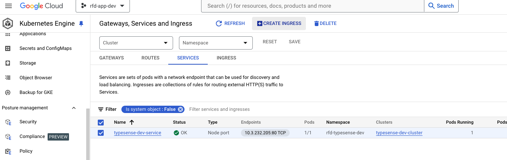

Select `External HTTP/S load balancer` and specify name.

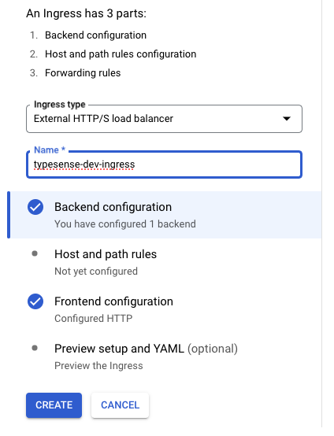

Select the exposed backend service from [Deploy Typesense docker image].(#deploy-typsense-docker-image)

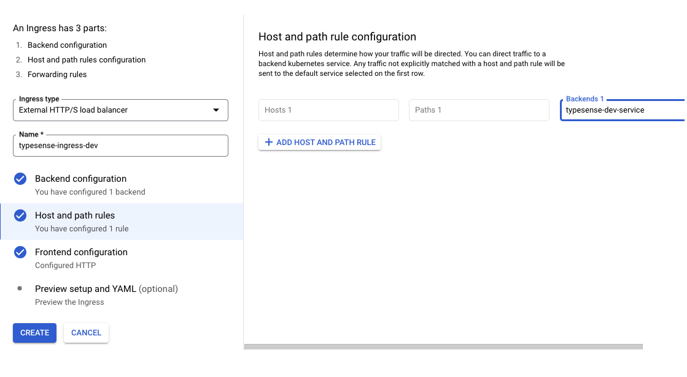

Create a new Google managed certificate and specify the domain name for the load balancer.

> Note: You must configure the DNS records (**A** record) for your domains to point to the IP address of the load balancer

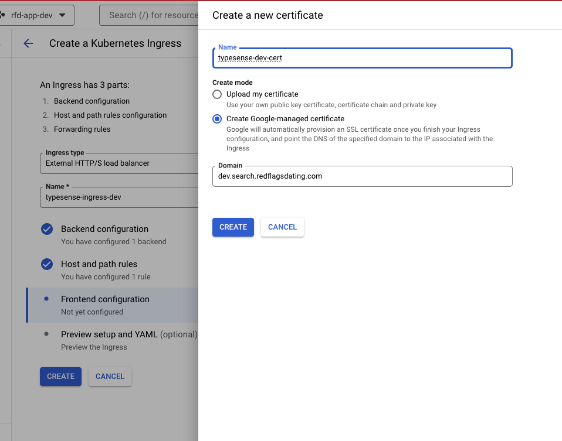

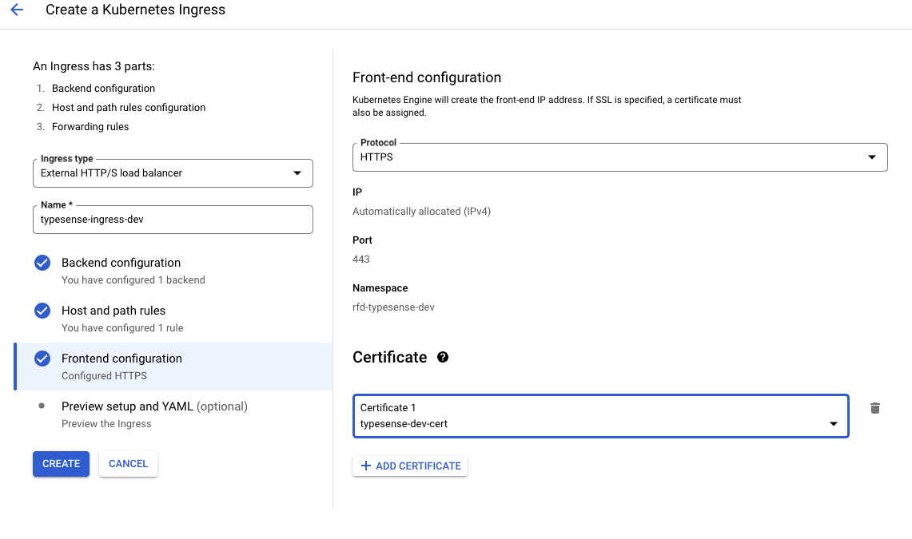

### Change default health check path

**Typesense** service default health check path is `/health` which is different with GKE default health check path `/`, thus it needs to be changed to ensure K8 Ingress passes health check.

Click ***Load balancer*** instance on the K8 Ingress instance page.

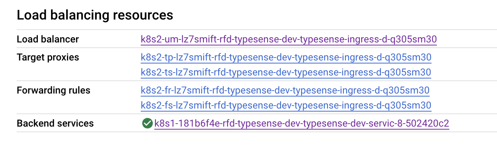

Click ***Health Check*** instance.

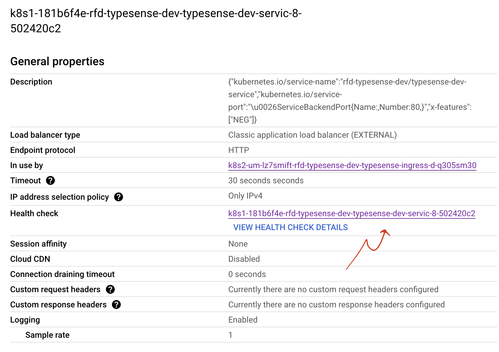

Click ***Edit*** -> change the **Path** to `/health`.

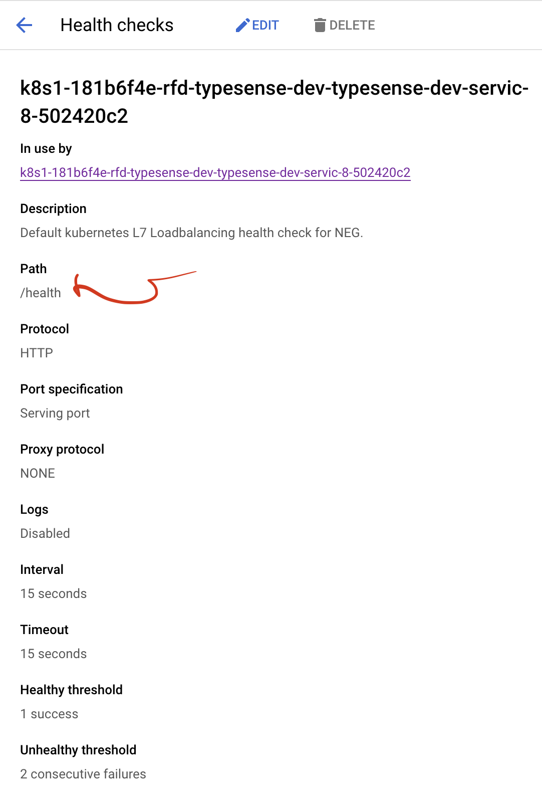

## Initialize Typesense collections

Create `users` collection to start backfill from Firestore `users` document.

```bash
curl https://dev.search.redflagsdating.com/collections \
-X POST \
-H "Content-Type: application/json" \
-H "X-TYPESENSE-API-KEY: xxxx" \
-d '{
  "name": "users",
  "fields": [
    {"name": "dob", "type": "auto" },
    {"name": "createdAt", "type": "auto" },
    {"name": "verified", "type": "bool" },
    {"name": "gender", "type": "string" },
    {"name": "genderFor", "type": "string[]" },
    {"name": "locality", "type": "string" },
    {"name": "redFlags", "type": "string[]" },
    {"name": "greenFlags", "type": "string[]" },
    {"name": "realTalk", "type": "auto" }
  ]
}'
```

To trigger backfill Firestore database to Typesense, just change `trigger` of `typesense_sync` collection in Firestore from `false` to `true`.

